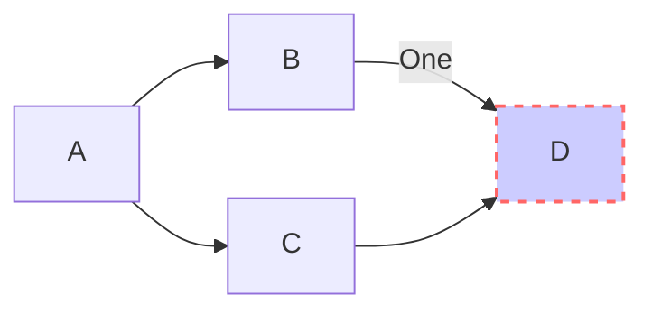
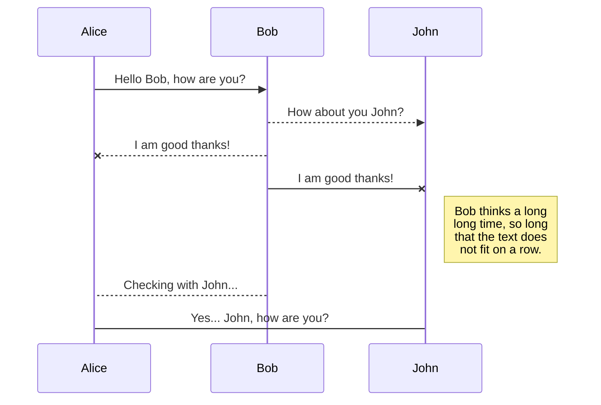

# 05 - Notes

## Syntax

Notes are written in [GitHub-flavored Markdown](https://guides.github.com/features/mastering-markdown), so you can write emojis (`:joy:` -> :joy:), ~~strikethrough~~ text etc. in a familiar fashion.

This also means that your notes aren't locked into any proprietary format.

Notes can have some metadata: if they are favorited or not, which tags they have, which attachments they have, etc. These metadata are written as Markdown front matter. This is taken care of for you. Hola

## Syntax Plugins

Some syntax plugins for providing you [KaTeX](https://katex.org), [AsciiMath](http://asciimath.org) and [mermaid](https://github.com/knsv/mermaid) support are built-in, check out this note's source.

#### KaTeX probando

Veamos

Wrap a formula in `$$` to display it as a block:

$$f(x)=\int_{-\infty}^{\infty} \hat{f}(\xi), e^{2 \pi i \xi x} d \xi$$

Wrap it in `$` to display it inline: $e^{iπ} + 1 = 0$.

Probando whatchman.

The [mhchem](https://docs.moodle.org/36/en/Chemistry_notation_using_mhchem) syntax for writing chemical expressions is supported too:
$$CO_2 + C \rightarrow 2 CO$$
$${SO_4^{2-} + Ba^{2+} -> BaSO_4}$$
$C_p[H_2O(l)}] = 75.3 J / mol K$

s:{CH3CH2OH} $\rightarrow$ s:{NH4+}

> **Note**: In order to minimize conflicts there mustn't be spaces at the beginning and end of a formula, and the ending `$` character musn't be followed by a digit. If you need to you can escape the `$` character with a backslash.

#### mermaid joder

## Attachments

Notes can have attachments, because sooner or later you'll want to save a file in a note, be it a boarding pass for your next trip or something else.

Attachments can be added by clicking the attachment into in the mainbar's toolbar. Attachments are simply copied into your data directory, under the `attachments` sub-directory.

You can open/remove them at any time.
