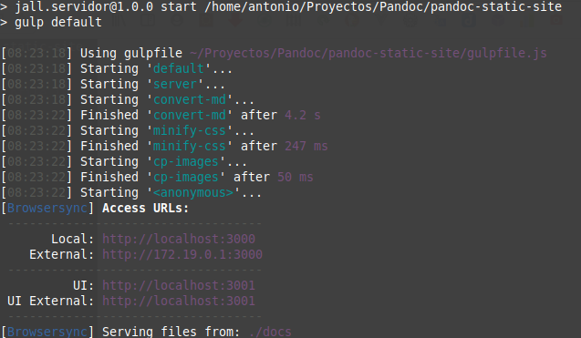

# El proyecto: crear un generador de sitios estáticos.

Una página web _estática_ (a veces llamada página plana) es una página web que se entrega al navegador del usuario exactamente como está almacenada en el servidor. Se opone a una página web _dinámica_. Se puede ampliar esta información en [Wikipedia](https://es.wikipedia.org/wiki/P%C3%A1gina_web_est%C3%A1tica).

En la actualidad resulta tedioso desarrollar una web de contenido estático escribiendo en html cada una de las páginas que la conforman. Por lo general se usan **generadores de sitios estáticos** escritos en distintos lenguajes de programación que facilitan esa tarea. En [este enlace (en inglés)](https://iwantmyname.com/blog/the-updated-big-list-of-static-website-generators-for-your-site-blog-or-wiki)
se puede consultar un amplio y actualizado listado de generadores de sitios clasificados por lenguajes de programación. Aquí crearemos uno desde cero.

# Markdown para el contenido.

En vez de utilizar la farragosa sintaxis del _html_ (extensión _.html_) se usará el lenguaje de marcado llamado **markdown** (extensión _.md_) por su simplicidad y rapidez a la hora de escribir contenido. No se explicarán aquí los detalles de este lenguaje. Si quiere saber más sobre markdown debería consultar como puntos de partida:

- [Wikipedia](https://es.wikipedia.org/wiki/Markdown).
- [markdown.es](https://markdown.es/).

Hay muy buena documentación al respecto. Existen muchos editores específicos para markdown y, además, los principales editores de texto tienen extensiones o plugins que facilitan su uso.

Un aspecto muy interesante de **Markdown** es que cuenta con unas extensiones (opcionales) que nos permiten escribir casi cualquier tipo de contenido. A modo de ejemplo, algunas de estas extensiones nos permiten escribir texto plano y...

- resaltar de código de programación
  ```javascript
  const js = require("mardown");
  ```
- usar $\LaTeX$ para escribir todo tipo de fórmulas científicas
  $$e^{iπ} + 1 = 0$$
- facilitar la escritura de fórmulas químicas:
  - s:{SO4^2-} + s:{Ba^2+} $\rightarrow$ s:{BaSO4}
  - $C_p[$s:{H2O(l)}$] = 75.3 \frac{J}{mol \cdot K}$
- dibujar diagramas utilizando texto:
  ```mermaid
    graph LR;
    A-->B;
    A-->C;
    B-->|One|D;
    C-->D;
    style D fill:#ccf,stroke:#f66,stroke-width:2px,stroke-dasharray: 5, 5
  ```

# El núcleo del proyecto: compilación con 'Pandoc', automatización con 'Gulp'.

Para convertir los documentos escritos en markdown en páginas web se utilizará la potente herramienta **Pandoc – A universal document converter**. Si no está familiarizado con **Pandoc** debería leer esto primero:

- [Pandoc](https://pandoc.org/) Web oficial. En inglés.
- [John MacFarlane](https://www.johnmacfarlane.net/). Profesor de filosofía y creador de Pandoc. En inglés.
- [Hacker News](https://news.ycombinator.com/item?id=24882480). Un buen sitio. Siempre. En inglés
- [Escritura sostenible en texto plano usando Pandoc y Markdown](https://programminghistorian.org/es/lecciones/escritura-sostenible-usando-pandoc-y-markdown#usar-pandoc-para-convertir-markdown-a-un-documento-de-ms-word). Muy buen artículo. En castellano.

Para automatizar la tarea de compilado (desagradable y rutinaria) usaremos **gulp**, que proporciona, además, un servidor web que permite visualizarla mientras se desarrolla.



Una explicación detallada del modo de trabajo del proyecto se pueden encontrar en la sección [Detalles](./detalles/index.html) en esta misma web.

# Web alojada en GitHub Pages

El resultado del proyecto se sirve desde el servicio de [Github Pages](https://pages.github.com/). Esto es así por tres razones:

1. Permite servir webs estáticas, adaptado al flujo de trabajo con git.
2. Permite acceder al código fuente del proyecto, se puede consultar [AQUÍ](https://github.com/joseantoniolopezlorenzo/pandoc-static-site).
3. Permite y facilita la colaboración entre desarrolladores.

Una buena introducción en castellano al uso de GitHub Pages la encontrará en [Developer Mozilla](https://developer.mozilla.org/es/docs/Learn/Using_Github_pages)
